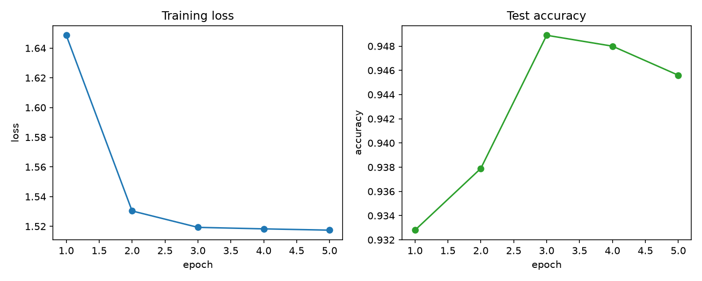

# Memristor-Aware Spiking Neural Networks

**Device → Algorithm.** Train a spiking neural network (SNN) with surrogate-gradient
descent in [snnTorch](https://snntorch.readthedocs.io), then deploy it on a *simulated
memristor crossbar* using **measured device non-idealities** — and quantify how much
accuracy real hardware costs you.

> The goal is the rare full-stack neuromorphic story: from a fabricated, characterized
> memristive device (SnS₂ synaptic devices measured at CSIR–NPL) all the way up to a
> trained spiking classifier running on a crossbar model of that same device.

---

## Why this project

Most SNN repos stop at software accuracy. Most memristor papers stop at a single device.
This project connects the two: it asks **"if I take a real, variable, non-ideal device and
build a network out of it, what actually happens to accuracy and energy?"**

That bridge — algorithm side (snnTorch, surrogate gradients, BPTT) meeting the device side
(conductance variability, drift, finite LTP/LTD levels) — is the contribution.

## Project status & roadmap

This repo is built in phases. See [`ROADMAP.md`](ROADMAP.md) for detail.

| Phase | Goal | Status |
|------:|------|--------|
| **1** | Clean, reproducible SNN baseline (MNIST → N-MNIST) | ✅ in this repo |
| **2** | Map trained network onto a memristor crossbar (differential-pair `G+−G−`) and inject device non-idealities; ideal-vs-memristor inference comparison | 🟡 layer + comparison in this repo; **measured** SnS₂ data lands in 2.5 |
| 3 | Accuracy vs. device variability/noise (sweeps); energy estimate (NeuroSim) | 🔜 |
| 4 | Package + short workshop paper / preprint | 🔜 |

## Quickstart

```bash
# 1. (optional) create an environment
python -m venv .venv && . .venv/Scripts/activate     # Windows
# python -m venv .venv && source .venv/bin/activate  # Linux/macOS

# 2. install
pip install -r requirements.txt

# 3. train the Phase-1 baseline on MNIST (writes metrics, curve, and a
#    reloadable checkpoint to results/model.pt)
python -m src.train --epochs 5 --num-steps 25

# 4. Phase 2: deploy that checkpoint on a simulated memristor crossbar and
#    measure the accuracy cost of the device non-idealities
python -m src.eval_memristor --num-levels 32 --weight-noise 0.05 --read-noise 0.02
```

Run `python -m src.train --help` / `python -m src.eval_memristor --help` for all
options (hidden size, LIF decay `beta`, time steps, conductance levels, write/read
noise, number of device trials, …). Pass `--limit-batches N` to either entry point
for a fast smoke run on a subset.

## What's inside

**Phase 1 — SNN baseline**
- A 2-layer **Leaky Integrate-and-Fire** SNN, trained end-to-end with **fast-sigmoid
  surrogate gradients** and backpropagation-through-time.
- Rate-coded MNIST input over a configurable number of time steps.
- Reproducible training loop with seeded runs, accuracy logging, a saved loss/accuracy
  curve, and a reloadable checkpoint.

**Phase 2 — memristor crossbar**
- `MemristorLinear`: an inference-time drop-in for `nn.Linear` that realizes each signed
  weight as a **differential conductance pair** (`G+ − G−`) and injects **finite conductance
  levels**, **programming (write) variability**, and **read noise**.
- `memristorize(model)` swaps every `nn.Linear` in a trained network for a crossbar, so the
  same model can be re-mapped across many independent "device instantiations".
- `src.eval_memristor` compares **software vs. ideal-crossbar vs. memristor-crossbar** accuracy
  (mean ± std over device trials) and reports the accuracy cost in percentage points.

```
memristor-aware-snn/
├── src/
│   ├── model.py          # LIF SNN definition (surrogate gradients)
│   ├── data.py           # dataset loaders (MNIST now; N-MNIST hook for later)
│   ├── train.py          # training / evaluation loop (entry point)
│   ├── memristor.py      # Phase 2: differential-pair crossbar layer + non-idealities
│   ├── eval_memristor.py # Phase 2: ideal-vs-memristor inference comparison (entry point)
│   └── utils.py          # seeding, plotting, metrics I/O
├── tests/                # fast unit tests (no dataset download)
├── .github/workflows/    # CI: unit tests + train/eval smoke
├── results/              # metrics, figures, checkpoint land here
├── requirements.txt
└── ROADMAP.md
```

## Results

Reproduce with the entry points above (CPU, seed 42). Raw outputs are written to
`results/` (git-ignored). The runs below: 5 epochs, 25 time steps, ~5.8 min train on CPU.

**Phase 1 — software baseline** (`python -m src.train --epochs 5 --num-steps 25`)

| Dataset | Model | Test accuracy |
|---------|-------|---------------|
| MNIST   | 784–256–10 LIF SNN, 25 steps | **94.9%** (best, epoch 3); 94.6% final-epoch checkpoint |



Full metrics: [`docs/phase1_metrics.json`](docs/phase1_metrics.json) ·
[`docs/phase2_memristor_eval.json`](docs/phase2_memristor_eval.json).

**Phase 2 — what the device costs** (`python -m src.eval_memristor --num-levels 32 --weight-noise 0.05 --read-noise 0.02 --trials 5`)

Deployed model = the final-epoch checkpoint (94.56% software). Memristor row is the mean ± std
over 5 independent device instantiations (different programming-variability draws).

| Configuration | Test accuracy |
|---------------|---------------|
| software (float) | 94.56% |
| ideal crossbar (control, non-idealities off) | 94.56% — exactly matches software ✓ |
| memristor crossbar (32 levels, 5% write / 2% read noise) | **93.16% ± 0.69%** (5 device trials) |

The headline number is the **accuracy cost**: software − memristor = **1.40 pp**. The ideal
crossbar reproducing the software accuracy to the digit confirms the mapping is correct, so the
1.40 pp drop is attributable purely to the injected device non-idealities. Phase 2.5 replaces
these synthetic knobs with **measured SnS₂ device statistics** from the CSIR–NPL characterization.

## Background

This work builds on measured memristive-device characteristics from my research, including
synaptic plasticity (PPF/PPD, LTP/LTD) of SnS₂-based devices:

- *Structural engineering of SnS₂ nanoflowers for neuromorphic applications*,
  J. Mater. Sci.: Mater. Electron. (2026), DOI: 10.1007/s10854-026-16751-w
- *Resistive Switching & Synapse Properties of Bilayered CuO/MAPbI₃ Films*,
  ACS Appl. Nano Mater. (2025), DOI: 10.1021/acsanm.5c04416

## License

MIT — see [`LICENSE`](LICENSE).
