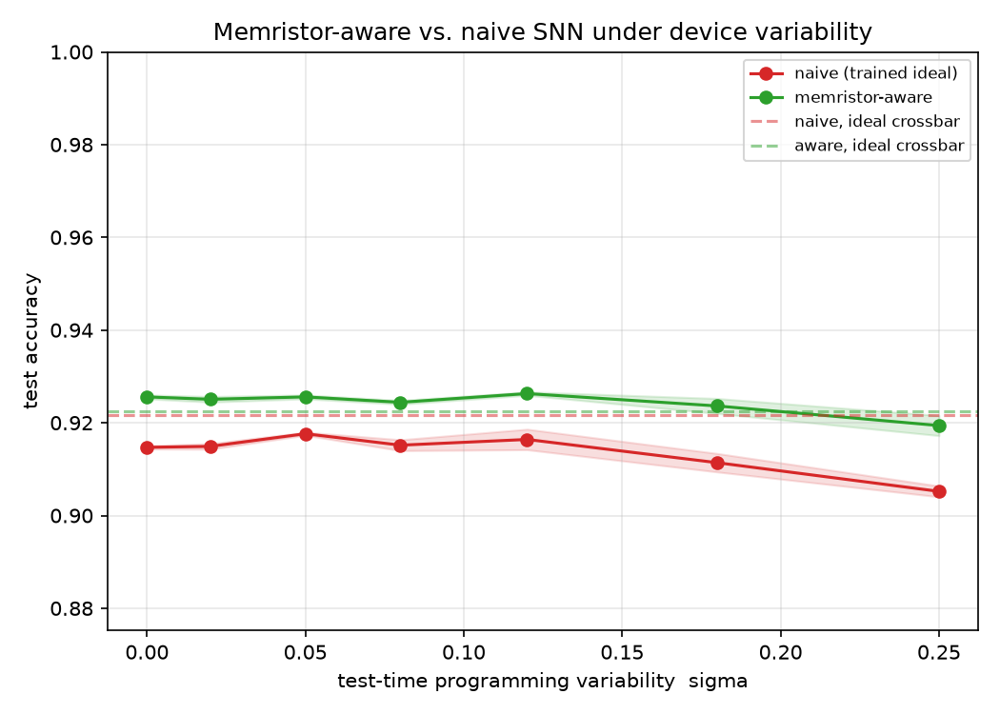

# Memristor-Aware Spiking Neural Networks

**Device → Algorithm.** Train a spiking neural network (SNN) with surrogate-gradient
descent in [snnTorch](https://snntorch.readthedocs.io), then deploy it on a *simulated
memristor crossbar* using **measured device non-idealities** — and quantify how much
accuracy real hardware costs you.

> The goal is the rare full-stack neuromorphic story: from a fabricated, characterized
> memristive device (SnS₂ synaptic devices measured at CSIR–NPL) all the way up to a
> trained spiking classifier running on a crossbar model of that same device.

---

## Why this project

Most SNN repos stop at software accuracy. Most memristor papers stop at a single device.
This project connects the two: it asks **"if I take a real, variable, non-ideal device and
build a network out of it, what actually happens to accuracy and energy?"**

That bridge — algorithm side (snnTorch, surrogate gradients, BPTT) meeting the device side
(conductance variability, drift, finite LTP/LTD levels) — is the contribution.

## Project status

**Complete (v1).** The full algorithm-side stack is built and validated end-to-end:
a spiking classifier trained with surrogate-gradient BPTT, deployed on a
differentiable memristor-crossbar model, with a memristor-aware-vs-naive robustness
study and reproducible results.

| Scope | Goal | Status |
|------:|------|--------|
| **1** | Clean, reproducible SNN baseline (LIF, surrogate gradients, BPTT, MNIST) | ✅ done |
| **2** | Differentiable memristor-crossbar synapses + memristor-aware training; accuracy-vs-variability sweep | ✅ done |

Device-side extensions (measured SnS₂ data, energy modelling, paper) are tracked as
[**Future scope**](#future-scope) below — the code already exposes the entry points
for them, so they slot in without restructuring.

> **Note on MemTorch.** MemTorch's `convert()` targets *inference* and is not
> differentiable, so it cannot sit inside a surrogate-gradient/BPTT training loop
> (and has no prebuilt wheels for current PyTorch on Windows). This project therefore
> uses a self-contained, differentiable device model
> ([`src/memristor.py`](src/memristor.py)) exposing the same parameters
> (conductance levels, programming/read variability) that MemTorch / aihwkit use.

## Quickstart

```bash
# 1. (optional) create an environment
python -m venv .venv && . .venv/Scripts/activate     # Windows
# python -m venv .venv && source .venv/bin/activate  # Linux/macOS

# 2. install
pip install -r requirements.txt

# 3. train the Phase-1 baseline on MNIST
python -m src.train --epochs 5 --num-steps 25

# results (metrics + training curve) are written to results/
```

Run `python -m src.train --help` for all options (hidden size, LIF decay `beta`,
time steps, learning rate, device).

## What's inside

**Phase 1 — SNN baseline**
- A 2-layer **Leaky Integrate-and-Fire** SNN, trained end-to-end with **fast-sigmoid
  surrogate gradients** and backpropagation-through-time.
- Rate-coded MNIST input over a configurable number of time steps.
- Reproducible training loop with seeded runs, accuracy logging, and a saved loss/accuracy curve.

**Phase 2 — memristor-aware training**
- A differentiable **memristor crossbar** synapse ([`src/memristor.py`](src/memristor.py)):
  differential-pair conductance encoding, finite conductance levels (STE-quantized),
  and programming/read variability injected on every forward pass.
- Drop-in for `nn.Linear` — pass `--device-preset` to train *through* the device.
- A naive-vs-aware experiment that sweeps device variability and shows the
  robustness gap.

```
memristor-aware-snn/
├── src/
│   ├── model.py      # LIF SNN; pluggable ideal/memristor synapses
│   ├── memristor.py  # differentiable memristor crossbar device model (Phase 2)
│   ├── data.py       # dataset loaders (MNIST now; N-MNIST hook for later)
│   ├── train.py      # training / evaluation loop (entry point)
│   ├── experiment.py # naive-vs-aware sweep, headline figure (entry point)
│   └── utils.py      # seeding, plotting, metrics I/O
├── results/          # metrics + figures land here
├── requirements.txt
└── ROADMAP.md
```

## Run it

```bash
# Phase 1 baseline (ideal synapses)
python -m src.train --epochs 5 --num-steps 25

# Phase 2 memristor-aware training on one device preset
python -m src.train --epochs 5 --device-preset synthetic

# Phase 2 headline experiment: naive vs aware + variability sweep
python -m src.experiment --epochs 3 --device-preset synthetic
```

Device presets live in [`src/memristor.py`](src/memristor.py): `ideal`, `mild`,
`synthetic`, `harsh` (override with `--n-levels` / `--sigma`).

> **These presets are synthetic.** Their conductance-level counts and noise levels
> are *plausible guesses*, **not** fitted to any measured device. Real SnS₂
> characterization data is a Phase-3 deliverable and will enter through
> `DeviceConfig.from_measurement` — until then, all results below are explicitly
> synthetic-device results.

## Results

784–256–10 LIF SNN, 20 steps, 3 epochs, `synthetic` device preset (16 conductance
levels, nominal σ=0.05 — **synthetic, not measured SnS₂**). Both networks share the
same crossbar architecture; the only difference is whether device non-idealities
were present **during training**. Deployed on the noisy crossbar and swept over
programming variability σ:

| σ (test) | naive (trained ideal) | memristor-aware | Δ |
|---------:|----------------------:|----------------:|----:|
| 0.00 | 0.915 | 0.926 | +1.1% |
| 0.05 | 0.918 | 0.926 | +0.8% |
| 0.12 | 0.916 | 0.926 | +1.0% |
| 0.18 | 0.911 | 0.924 | +1.3% |
| 0.25 | 0.905 | 0.919 | +1.4% |



**Read it honestly:** the aware model wins at *every* noise level, and — the key
point — it stays flat as σ grows while the naive model droops, so the gap *widens*
with device variability. The absolute margin is modest (~1%) because an MLP on
MNIST is inherently robust and `synthetic` is a gentle device; the effect grows with a
harsher device (`--device-preset harsh`) and will matter more on N-MNIST / deeper
nets. Full numbers in
[`results/experiment_metrics.json`](results/experiment_metrics.json).

## Future scope

v1 builds and validates the **algorithm side** on a *synthetic* device. The natural
extensions are all **device-side** — turning "a memristor-aware SNN" into "*my*
measured SnS₂ device running a spiking classifier." Each has an entry point already
in the code, so none requires restructuring:

- **Measured SnS₂ device parameters.** Replace the synthetic presets with real
  characterization data via `DeviceConfig.from_measurement` (stub in
  [`src/memristor.py`](src/memristor.py)): number of stable conductance states from
  LTP/LTD curves, cycle-to-cycle / device-to-device variability, and on/off ratio.
  This is the project's true differentiator — until then all results are explicitly
  synthetic.
- **Richer non-idealities.** Conductance **drift** over time and **LTP/LTD
  asymmetry** (the device potentiates and depresses unequally) — both fold into the
  `_conductance` transform alongside the existing quantization + variability.
- **Harder task.** Swap MNIST → **N-MNIST / DVS-Gesture** (event-based) through the
  existing `load_dataset` hook in [`src/data.py`](src/data.py), where device
  imperfection should bite harder.
- **Energy estimate.** Cross-reference accuracy with an energy/area model
  (**NeuroSim / DNN+NeuroSim**) for the full accuracy-vs-energy story.
- **Hardware cross-check.** Optionally validate the device model against **IBM
  aihwkit** inference, or run the trained SNN on real neuromorphic hardware
  (SpiNNaker/Loihi via EBRAINS/INRC).
- **Writeup.** Package the synthetic + measured results into a short workshop paper /
  preprint.

## Background

This work builds on measured memristive-device characteristics from my research, including
synaptic plasticity (PPF/PPD, LTP/LTD) of SnS₂-based devices:

- *Structural engineering of SnS₂ nanoflowers for neuromorphic applications*,
  J. Mater. Sci.: Mater. Electron. (2026), DOI: 10.1007/s10854-026-16751-w
- *Resistive Switching & Synapse Properties of Bilayered CuO/MAPbI₃ Films*,
  ACS Appl. Nano Mater. (2025), DOI: 10.1021/acsanm.5c04416

## License

MIT — see [`LICENSE`](LICENSE).
